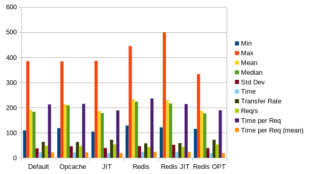
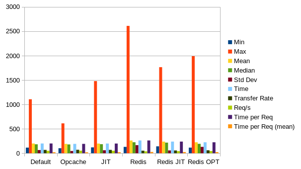

# Banchmarks

## Nextcloud Benchmarks

Every benchmark is run three times. The written data are the average values.

#### Benchmark: **ab -n 1000 -c 10 https://nextcloud.domain.com/**

| Settings  | Min    | Max    | Mean   | Median | Std Dev | Time     |
| --------- | ------ | ------ | ------ | ------ | ------- | -------- |
| Default   | 109 ms | 385 ms | 191 ms | 183 ms | 37,5 ms | 21,268 s |
| OPChache  | 118 ms | 384 ms | 213 ms | 209 ms | 45,5 ms | 21,472 s |
| JIT       | 104 ms | 386 ms | 186 ms | 178 ms | 38,9 ms | 18,807 s |
| Redis     | 128 ms | 445 ms | 233 ms | 223 ms | 46,2 ms | 23,589 s |
| Redis JIT | 121 ms | 500 ms | 229 ms | 216 ms | 51,6 ms | 23,183 s |
| Redis OPT | 115 ms | 333 ms | 187 ms | 177 ms | 38,4 ms | 18,908 s |

| Settings  | Req/s | Time per Req | Time per Req (mean) | Transfer Rate |
| --------- | ----- | ------------ | ------------------- | ------------- |
| Default   | 47,02 | 212,268 ms   | 21,268 ms           | 63,54 KB/s    |
| OPCache   | 46,57 | 214,717 ms   | 21,472 ms           | 62,96 KB/s    |
| JIT       | 53,17 | 188,070 ms   | 18,807 ms           | 71,87 KB/s    |
| Redis     | 42,39 | 235,890 ms   | 23,589 ms           | 57,30 KB/s    |
| Redis JIT | 43,12 | 213,825 ms   | 23,183 ms           | 58,30 KB/s    |
| Redis OPT | 52,89 | 189,084 ms   | 18,908 ms           | 71,49 KB/s    |

#### Benchmark: **ab -n 10000 -c 10 https://nextcloud.domain.com/**

| Settings  | Min    | Max     | Mean   | Median | Std Dev  | Time      |
| --------- | ------ | ------- | ------ | ------ | -------- | --------- |
| Default   | 115 ms | 1106 ms | 199 ms | 183 ms | 64,7 ms  | 199,429 s |
| OPChache  | 102 ms | 612 ms  | 191 ms | 180 ms | 45,6 ms  | 191,276 s |
| JIT       | 120 ms | 1479 ms | 198 ms | 185 ms | 60,6 ms  | 198,278 s |
| Redis     | 130 ms | 2610 ms | 261 ms | 225 ms | 164,9 ms | 261,588 s |
| Redis JIT | 141 ms | 1764 ms | 238 ms | 217 ms | 57,1 ms  | 238,348 s |
| Redis OPT | 115 ms | 1990 ms | 224 ms | 192 ms | 130,2 ms | 224,196 s |

| Settings  | Req/s | Time per Req | Time per Req (mean) | Transfer Rate |
| --------- | ----- | ------------ | ------------------- | ------------- |
| Default   | 50,14 | 199,429 ms   | 19,943 ms           | 67,77 KB/s    |
| OPCache   | 52,28 | 191,276 ms   | 19,128 ms           | 70,66 KB/s    |
| JIT       | 50,43 | 198,278 ms   | 19,828 ms           | 68,17 KB/s    |
| Redis     | 38,23 | 261,588 ms   | 26,159 ms           | 51,67 KB/s    |
| Redis JIT | 41,96 | 238,348 ms   | 23,835 ms           | 56,70 KB/s    |
| Redis OPT | 44,60 | 224,196 ms   | 22,420 ms           | 60,28 KB/s    |

